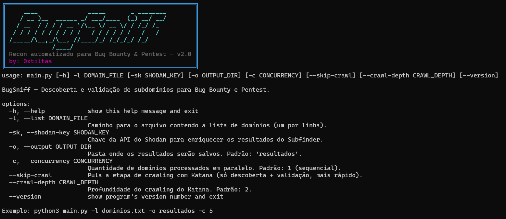

# BugSniff (Descoberta de Subdomínios)

>**0xtiltas**



BugSniff é uma ferramenta de automação para a fase inicial de reconhecimento em programas de Bug Bounty e pentests. Esta versão foca em três tarefas essenciais: descobrir subdomínios de forma massiva, validar quais deles estão realmente ativos e apresentar tudo de forma clara no terminal para você priorizar onde investigar.

A ferramenta foi projetada para ser leve, para apoio em atividades do meu dia a dia.

## Funcionalidades

-   **Enumeração de Subdomínios:** Utiliza o **Subfinder** para descobrir subdomínios de uma lista de alvos.
-   **Enriquecimento com API (Opcional):** Permite o uso de uma chave da API do **Shodan** para obter resultados de subdomínios ainda mais completos e precisos.
-   **Validação de Hosts Ativos:** Utiliza o **Httpx** (modo JSON) para verificar quais subdomínios estão ativos, coletando também **status code, título da página e tecnologia/servidor**.
-   **Terminal amigável:** Banner, cores, barra de progresso e tabela de resultados via `rich`/`pyfiglet`.
-   **Concorrência:** Processa vários domínios em paralelo com `-c`.
-   **Saída dupla:**
    -   `subdominios_ativos_final.txt` — lista simples de URLs, pronta para outras ferramentas.
    -   `subdominios_ativos_final.csv` — dados completos (status, título, tech) para você priorizar os testes.

## Pré-requisitos (IMPORTANTE)

Para que o BugSniff funcione, você **PRECISA** ter as seguintes ferramentas Go instaladas e configuradas no `PATH` do seu sistema. O Python 3.6+ também é necessário.

**1. Go (Linguagem de Programação)**
   - Verifique se o Go está instalado: `go version`
   - Se não estiver, siga o guia de instalação oficial: [https://golang.org/doc/install](https://golang.org/doc/install)
   - Lembre-se de configurar as variáveis de ambiente (`GOPATH`, `GOBIN`) corretamente.

**2. Python 3.6+**
   - Verifique a versão: `python3 --version`

**3. Ferramentas da ProjectDiscovery**
   - Execute os seguintes comandos no seu terminal para instalar o `subfinder`, o `httpx` e o `katana`:

   ```bash
   go install -v [github.com/projectdiscovery/subfinder/v2/cmd/subfinder@latest](https://github.com/projectdiscovery/subfinder/v2/cmd/subfinder@latest)
   go install -v [github.com/projectdiscovery/httpx/cmd/httpx@latest](https://github.com/projectdiscovery/httpx/cmd/httpx@latest)
   go install -v [github.com/projectdiscovery/katana/cmd/katana@latest](https://github.com/projectdiscovery/katana/cmd/katana@latest)
   ```
   - Após a instalação, feche e reabra seu terminal e verifique se as ferramentas são reconhecidas:
   ```bash
   subfinder -h
   httpx -h
   katana -h
   ```

   > **Qual a diferença entre o httpx e o katana?** O **httpx** é quem valida se um host está online/ativo (é a etapa de "validação"). O **katana** entra *depois*, só nos hosts que o httpx já confirmou como ativos, e faz o **crawling**: navega pelo site em busca de URLs internas, endpoints, arquivos JS e parâmetros — ou seja, aprofunda o reconhecimento dentro de cada alvo já validado.

## Instalação

Clone o projeto e instale as dependências Python (`rich` e `pyfiglet`, usadas para a interface de terminal):

```bash
git clone https://github.com/t1lt45/BugSniff.git
cd BugSniff
pip install -r requirements.txt
```

## Como Usar

A ferramenta é executada via linha de comando. Você precisa fornecer um arquivo de texto com os domínios que deseja analisar.

**Sintaxe:**
```bash
python3 main.py -l <arquivo_de_dominios.txt> [opções]
```

### Argumentos

| Argumento Curto | Argumento Longo | Descrição                                                                                                 | Obrigatório |
| :-------------- | :-------------- | :-------------------------------------------------------------------------------------------------------- | :---------- |
| `-l`            | `--list`        | Caminho para o arquivo contendo a lista de domínios (um por linha).                                       | **Sim** |
| `-o`            | `--output`      | Nome da pasta onde os resultados serão salvos. (Padrão: `resultados`)                                     | Não         |
| `-sk`           | `--shodan-key`  | Sua chave da API do Shodan para obter melhores resultados de subdomínios.                                   | Não         |
| `-c`            | `--concurrency` | Quantidade de domínios processados em paralelo. (Padrão: `1`)                                              | Não         |
|                 | `--version`     | Mostra a versão da ferramenta.                                                                              | Não         |

### Exemplos de Uso

**1. Uso sem API**

-   Crie um arquivo `dominios.txt`:
    ```txt
    example.com
    google.com
    ```
-   Execute o comando:
    ```bash
    python3 main.py -l dominios.txt -o meus_resultados
    ```

**2. Uso com a API do Shodan**

-   Execute o comando fornecendo sua chave:
    ```bash
    python3 main.py -l dominios.txt -o meus_resultados -sk SUA_CHAVE_API_DO_SHODAN_AQUI
    ```

### Saída

Durante a execução, o BugSniff exibe no terminal uma barra de progresso e, ao final, uma tabela colorida com cada subdomínio ativo, status HTTP, título da página e tecnologia detectada — para você priorizar rapidamente onde investigar.

Além disso, uma pasta de saída (ex: `meus_resultados`) será criada com os arquivos intermediários de cada ferramenta e dois arquivos finais:

-   **`subdominios_ativos_final.txt`**: Lista simples de URLs ativas, uma por linha, pronta para outras ferramentas (ex: `nuclei -l subdominios_ativos_final.txt`).
-   **`subdominios_ativos_final.csv`**: Mesma lista, mas com colunas `url,status_code,title,webserver,tech` — útil para filtrar e priorizar alvos antes de partir para os testes de intrusão.
